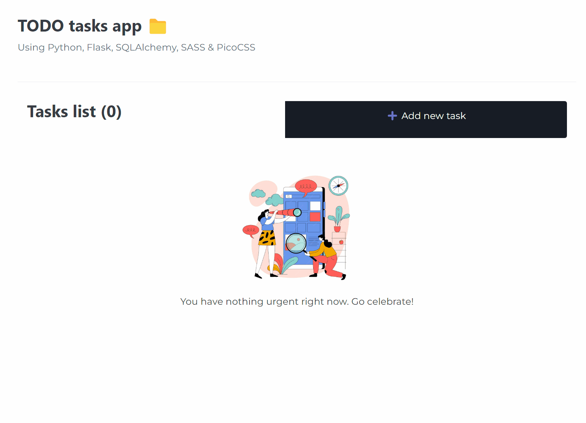

# Flask To-Do App Tracker

## See the page up and running:
https://desiremcarm.pythonanywhere.com

## Techs used

Deployed with

### Objective 🎯
---
To learn more about Flask, Python and SQLAlchemy by doing a simple CRUD application

### How does the app work ⚙️
---
1. An empty dashboard is displayed
2. You can do the following actions

| Option | Description |
| ----------- | ----------- |
| Add Task | Add a new task to the sql database. |
| Edit Task | Edit an existing task in the database. |
| Delete Task | Delete an existing task in the database. |

### Demo GIF 📹
---

Python, SASS, Flask, SQLAlchemy, JavaScript
